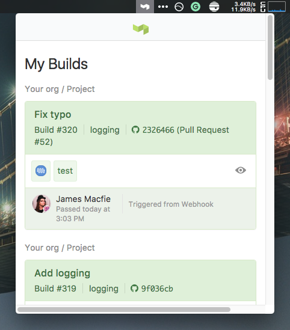

# BuildKite - My Builds

A small menubar app that shows your BuildKite Builds. Supports MacOS, Windows, and Linux.

Download the current version: [v0.1.0](https://github.com/jamesmacfie/buildkite/releases/tag/v0.1.0)

For Windows, the Edge browser may complain about this being "unsafe" which is just because I haven't signed the app. It's Ok, I promise. The task bar icon may also be hidden by default in Windows 10 but you can find it again by expanding all the icons. You'll see a black and white BuildKite icon there.

You can still navigate around the Buildkite site from this window but there are some CSS changes which may screw things up for you.
